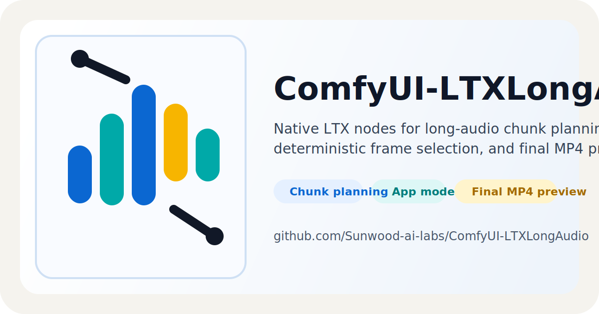

<p align="center">
  
</p>

<p align="center">
  <strong>長尺音声向け ComfyUI ワークフローのためのネイティブ <code>LTX*</code> カスタムノード集。</strong><br>
  チャンク計画、フレームフォルダ選択、ループ制御、静止画動画化、最終 MP4 プレビューまでを 1 つのリポジトリにまとめています。
</p>

<p align="center">
  <a href="https://github.com/Sunwood-ai-labs/ComfyUI-LTXLongAudio/actions/workflows/ci.yml"></a>
  <a href="https://github.com/Sunwood-ai-labs/ComfyUI-LTXLongAudio/actions/workflows/deploy-docs.yml"></a>
  
  
  <a href="LICENSE"></a>
</p>

<p align="center">
  <a href="README.md">English</a>
  |
  <a href="README.ja.md"><strong>日本語</strong></a>
  |
  <a href="https://sunwood-ai-labs.github.io/ComfyUI-LTXLongAudio/">Docs</a>
</p>

## 波形概要

このリポジトリは、同梱の長尺音声スモークワークフローで使うネイティブ `LTX*` ノードをまとめたものです。ループ制御、チャンク生成、音声連結、最終プレビュー出力までを外部ノードパックに頼らず GitHub 上で完結させられます。

主な想定は、Google Colab やデスクトップ環境で `ComfyUI/custom_nodes` に clone し、少ない App mode 入力だけでワークフローを動かす流れです。

- `Frames Folder`
- `Source Audio Upload`
- `Segment Seconds`
- `Random Seed`

## 主な特徴

- 長尺音声ヘルパー: `LTXAudioDuration`、`LTXLongAudioSegmentInfo`、`LTXAudioSlice`、`LTXAudioConcatenate` で長さに応じたチャンク計画と音声結合を行えます。
- ネイティブ入力ノード: `LTXLoadAudioUpload`、`LTXLoadImageUpload`、`LTXBatchUploadedFrames`、`LTXLoadImages` でフォルダ＋音声ワークフローを ComfyUI 標準入力の延長で扱えます。
- ネイティブループ制御: `LTXWhileLoopStart`、`LTXWhileLoopEnd`、`LTXForLoopStart`、`LTXForLoopEnd` により旧来のループ系ノードパックが不要です。
- ネイティブ動画プレビュー経路: `LTXBuildChunkedStillVideo`、`LTXEnsureImageBatch`、`LTXEnsureAudio`、`LTXVideoCombine` でチャンクごとのフレームと元音声から 1 本の MP4 を作れます。
- ネイティブ補助ノード: `LTXSimpleMath`、`LTXSimpleCalculator`、`LTXCompare`、`LTXIfElse`、`LTXIndexAnything`、`LTXBatchAnything`、`LTXSeedList`、`LTXShowAnything` を同梱しています。
- LTX 用ユーティリティ置換: `LTXVAELoader`、`LTXImageResize`、`LTXChunkFeedForward`、`LTXSamplingPreviewOverride`、`LTXNormalizedAttentionGuidance` で同梱グラフの補助ノードも置き換えています。

## クイックスタート

```bash
cd /content/ComfyUI/custom_nodes
git clone https://github.com/Sunwood-ai-labs/ComfyUI-LTXLongAudio.git
uv pip install -r ComfyUI-LTXLongAudio/requirements.txt
```

その後、ComfyUI を再起動してください。

同梱ワークフローは、次のようなフォルダ＋音声のスモーク実行を想定しています。

1. ComfyUI 標準の `LoadAudio` で 1 曲アップロードします。
2. `samples/input/frames_pool` か任意の入力フォルダを選びます。
3. `Segment Seconds` は既定の 20 秒のままでも変更しても構いません。
4. `LTXBuildChunkedStillVideo` が各チャンクから決定的に 1 枚ずつフレームを選びます。
5. `LTXVideoCombine` の出力で最終 MP4 をプレビューします。

## サンプル資産

- ワークフロー: `samples/workflows/LTXLongAudio_CustomNodes_SmokeTest.json`
- サンプル資産ルート: `samples/input/`
- レイアウト検査: `scripts/check_workflow_layout.py`
- API スモーク実行: `scripts/run_comfyui_api_smoke.py`

同梱ワークフローには具体的な既定値が入っています。

- フレームフォルダ: `samples/input/frames_pool`
- 音声ウィジェット既定値: `HOWL AT THE HAIRPIN2.wav`

CPU ベースの確認でも扱いやすいように、サンプルは軽量に保っています。

- `samples/input/frames_pool` には `688x384` の quarter-resolution フレームを収録
- `samples/input/demo_frames` には `192x108` の小さなデバッグ用フレームを収録
- `samples/input/ltx-demo-tone.wav` は追跡済み fallback 音声として利用可能

長いローカルサンプルが無い場合、`run_comfyui_api_smoke.py` は fallback tone を期待されるファイル名へコピーしてスモーク実行します。

詳細は [samples/README.md](samples/README.md) と docs を参照してください。

- [Getting Started](docs/guide/getting-started.md)
- [Usage Guide](docs/guide/usage.md)
- [Architecture](docs/guide/architecture.md)
- [Troubleshooting](docs/guide/troubleshooting.md)

## ノード一覧

### 入力とステージング

- `LTXLoadAudioUpload`
- `LTXLoadImageUpload`
- `LTXLoadImages`
- `LTXBatchUploadedFrames`
- `LTXRepeatImageBatch`

### チャンク計画とメディア組み立て

- `LTXAudioDuration`
- `LTXLongAudioSegmentInfo`
- `LTXRandomImageIndex`
- `LTXAudioSlice`
- `LTXBuildChunkedStillVideo`
- `LTXDummyRenderSegment`
- `LTXAppendImageBatch`
- `LTXAppendAudio`
- `LTXEnsureImageBatch`
- `LTXEnsureAudio`
- `LTXAudioConcatenate`
- `LTXVideoCombine`

### フロー制御と補助ノード

- `LTXWhileLoopStart`, `LTXWhileLoopEnd`
- `LTXForLoopStart`, `LTXForLoopEnd`
- `LTXIfElse`
- `LTXCompare`
- `LTXSimpleMath`
- `LTXSimpleCalculator`
- `LTXIntConstant`
- `LTXIndexAnything`
- `LTXBatchAnything`
- `LTXSeedList`
- `LTXShowAnything`

### LTX ワークフロー置換ノード

- `LTXVAELoader`
- `LTXImageResize`
- `LTXChunkFeedForward`
- `LTXSamplingPreviewOverride`
- `LTXNormalizedAttentionGuidance`

## 検証ループ

ローカル検証と公開前チェックには `uv` を使います。

```bash
uv run pytest

uv run python scripts/check_workflow_layout.py \
  samples/workflows/LTXLongAudio_CustomNodes_SmokeTest.json \
  --require-all-nodes-in-groups \
  --require-app-mode

uv run python scripts/run_comfyui_api_smoke.py \
  --workflow samples/workflows/LTXLongAudio_CustomNodes_SmokeTest.json
```

同梱ワークフローには `extra.linearData` と `extra.linearMode` が入っていて、現在の ComfyUI App mode ビルダー挙動と整合します。

## トラブルシューティング

- カスタムノード更新後は ComfyUI バックエンドまたはデスクトップアプリを完全再起動してください。ホットリロードだと古い入力スキーマが残ることがあります。
- プレビューが短すぎる場合は、まずバックエンド状態の stale を疑ってください。同梱グラフは先頭チャンクだけでなく元音声の全長を描画する想定です。
- 最終 mux には `ffmpeg` が必要なので、ComfyUI 起動前にランタイムから見える状態にしておく必要があります。
- セグメントごとのフレーム数は LTX 系ワークフローとの相性のため 8 フレーム単位に量子化されます。

## リポジトリ構成

```text
.
|-- docs/                         # VitePress docs と共有 SVG アセット
|-- samples/
|   |-- input/                   # 軽量なサンプル画像群と音声
|   `-- workflows/               # App mode 対応済みのスモークワークフロー
|-- scripts/
|   |-- check_workflow_layout.py # グループ、重なり、App mode、実行契約の検査
|   `-- run_comfyui_api_smoke.py # 実 ComfyUI /prompt API を使うスモーク実行
|-- tests/                       # import、レイアウト、スクリプト回帰テスト
|-- nodes.py                     # カスタムノード本体と登録テーブル
`-- README.md                    # 英語版トップガイド
```

## ライセンス

GPL-3.0-or-later
