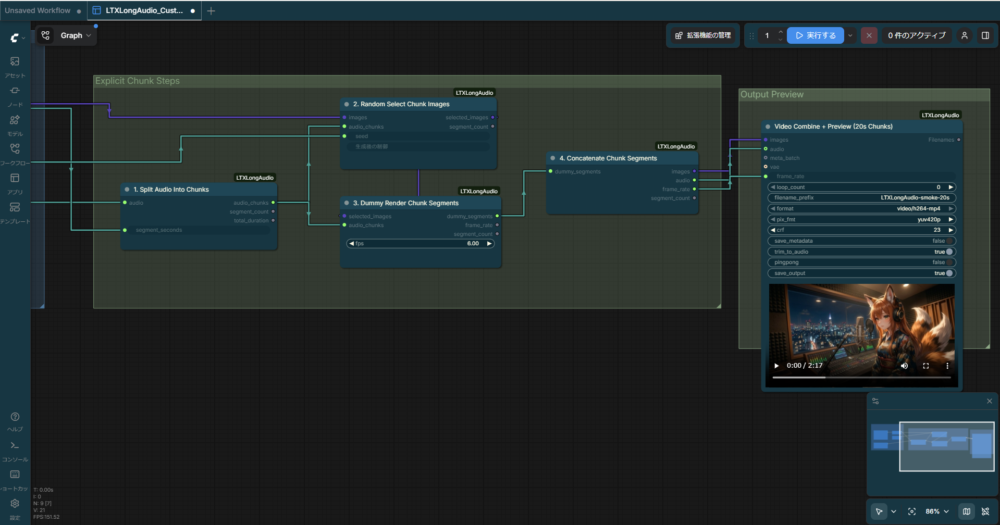
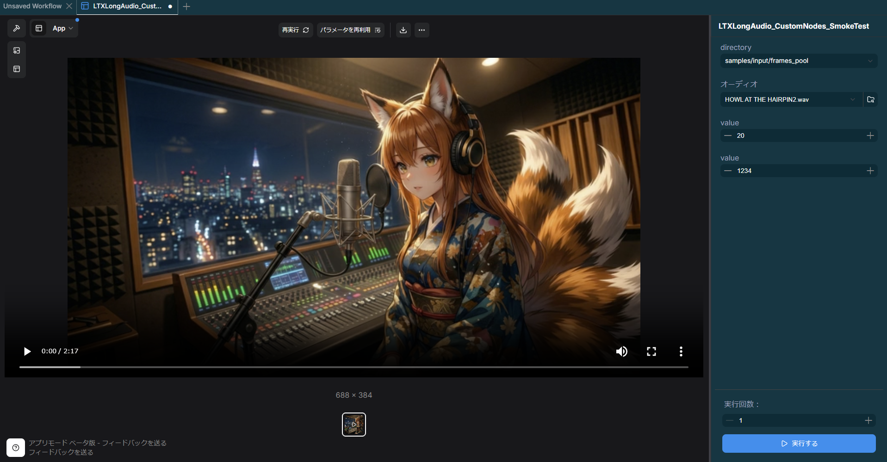

<p align="center">
  
</p>

<p align="center">
  <strong>Native <code>LTX*</code> custom nodes for long-audio ComfyUI workflows.</strong><br>
  Chunk planning, frame-folder selection, loop control, still-video assembly, and final MP4 preview in one repository.
</p>

<p align="center">
  <a href="https://github.com/Sunwood-ai-labs/ComfyUI-LTXLongAudio/actions/workflows/ci.yml"></a>
  <a href="https://github.com/Sunwood-ai-labs/ComfyUI-LTXLongAudio/actions/workflows/deploy-docs.yml"></a>
  
  
  <a href="LICENSE"></a>
</p>

<p align="center">
  <a href="README.md"><strong>English</strong></a>
  |
  <a href="README.ja.md">Japanese</a>
  |
  <a href="https://sunwood-ai-labs.github.io/ComfyUI-LTXLongAudio/">Docs</a>
</p>

## Waveform Overview

This repository packages the native `LTX*` nodes used by the bundled long-audio smoke workflow, so you can keep the whole graph on GitHub without depending on external node packs for loop control, chunk assembly, audio concatenation, or final preview output.

It is designed for the common Colab and desktop flow where custom nodes are cloned into `ComfyUI/custom_nodes`, then exercised through a small App mode surface:

- `Frames Folder`
- `Source Audio Upload`
- `Segment Seconds`
- `Random Seed`

## Visual Preview



The current App mode surface stays focused on folder selection, source-audio upload, chunk length, and deterministic seed control.

## Signal Highlights

- Native long-audio helpers: `LTXAudioDuration`, `LTXLongAudioSegmentInfo`, `LTXAudioSlice`, and `LTXAudioConcatenate` handle duration-aware chunk planning and audio stitching.
- Native image and folder inputs: `LTXLoadAudioUpload`, `LTXLoadImageUpload`, `LTXBatchUploadedFrames`, and `LTXLoadImages` keep folder-plus-audio workflows inside core ComfyUI inputs.
- Native loop control: `LTXWhileLoopStart`, `LTXWhileLoopEnd`, `LTXForLoopStart`, and `LTXForLoopEnd` remove the need for legacy loop-control packs.
- Native preview path: `LTXBuildChunkedStillVideo`, `LTXEnsureImageBatch`, `LTXEnsureAudio`, and `LTXVideoCombine` generate one previewable MP4 from per-chunk frames plus the original full-length audio.
- Native workflow utilities: `LTXSimpleMath`, `LTXSimpleCalculator`, `LTXCompare`, `LTXIfElse`, `LTXIndexAnything`, `LTXBatchAnything`, `LTXSeedList`, and `LTXShowAnything` cover the helper surfaces used by the shipped graph.
- Native LTX utility replacements: `LTXVAELoader`, `LTXImageResize`, `LTXChunkFeedForward`, `LTXSamplingPreviewOverride`, and `LTXNormalizedAttentionGuidance` replace the extra utility nodes required by the bundled graph.

## Quick Start

```bash
cd /content/ComfyUI/custom_nodes
git clone https://github.com/Sunwood-ai-labs/ComfyUI-LTXLongAudio.git
uv pip install -r ComfyUI-LTXLongAudio/requirements.txt
```

Then restart ComfyUI.

The checked-in workflow is ready for the common folder-plus-audio smoke pass:

1. Upload one song with ComfyUI's built-in `LoadAudio` control.
2. Select `samples/input/frames_pool` or another input-folder source.
3. Keep the default 20-second chunk length, or change `Segment Seconds`.
4. Let `LTXBuildChunkedStillVideo` pick one deterministic frame per chunk.
5. Preview the final MP4 from `LTXVideoCombine`.

## Sample Assets

- Workflow: `samples/workflows/LTXLongAudio_CustomNodes_SmokeTest.json`
- Sample asset root: `samples/input/`
- Layout checker: `scripts/check_workflow_layout.py`
- API smoke runner: `scripts/run_comfyui_api_smoke.py`

The bundled workflow ships with concrete defaults:

- Frame folder: `samples/input/frames_pool`
- Audio widget default: `ltx-demo-tone.wav`

The sample asset set stays intentionally lightweight so CPU-side smoke runs remain practical:

- `samples/input/frames_pool` contains quarter-resolution `688x384` frames.
- `samples/input/demo_frames` contains tiny `192x108` debug frames.
- `samples/input/ltx-demo-tone.wav` remains available as the tracked fallback audio.

If you keep a longer local sample named `HOWL AT THE HAIRPIN2.wav`, the API smoke script prefers it and stages it under the tracked widget filename for prompt validation.

More detail lives in [samples/README.md](samples/README.md) and the published guides:

- [Getting Started](docs/guide/getting-started.md)
- [Usage Guide](docs/guide/usage.md)
- [Architecture](docs/guide/architecture.md)
- [Troubleshooting](docs/guide/troubleshooting.md)

## Node Catalog

### Inputs and staging

- `LTXLoadAudioUpload`
- `LTXLoadImageUpload`
- `LTXLoadImages`
- `LTXBatchUploadedFrames`
- `LTXRepeatImageBatch`

### Chunk planning and media assembly

- `LTXAudioDuration`
- `LTXLongAudioSegmentInfo`
- `LTXRandomImageIndex`
- `LTXAudioSlice`
- `LTXBuildChunkedStillVideo`
- `LTXDummyRenderSegment`
- `LTXAppendImageBatch`
- `LTXAppendAudio`
- `LTXEnsureImageBatch`
- `LTXEnsureAudio`
- `LTXAudioConcatenate`
- `LTXVideoCombine`

### Flow control and utility nodes

- `LTXWhileLoopStart`, `LTXWhileLoopEnd`
- `LTXForLoopStart`, `LTXForLoopEnd`
- `LTXIfElse`
- `LTXCompare`
- `LTXSimpleMath`
- `LTXSimpleCalculator`
- `LTXIntConstant`
- `LTXIndexAnything`
- `LTXBatchAnything`
- `LTXSeedList`
- `LTXShowAnything`

### LTX workflow replacements

- `LTXVAELoader`
- `LTXImageResize`
- `LTXChunkFeedForward`
- `LTXSamplingPreviewOverride`
- `LTXNormalizedAttentionGuidance`

## Verification Loop

Use `uv` for local verification and publishing checks:

```bash
uv run pytest

uv run python scripts/check_workflow_layout.py \
  samples/workflows/LTXLongAudio_CustomNodes_SmokeTest.json \
  --require-all-nodes-in-groups \
  --require-app-mode

uv run python scripts/run_comfyui_api_smoke.py \
  --workflow samples/workflows/LTXLongAudio_CustomNodes_SmokeTest.json \
  --comfy-root /path/to/ComfyUI
```

The bundled smoke workflow includes `extra.linearData` and `extra.linearMode`, matching the current ComfyUI App mode builder behavior.

## Troubleshooting Notes

- Fully restart the ComfyUI backend or desktop app after updating custom nodes. Hot reload can preserve stale input schemas.
- If a preview looks unexpectedly short, stale backend state is the first thing to check. The bundled graph is intended to render the full source audio length, not only the first chunk.
- Final muxing uses `ffmpeg`, so the runtime should expose `ffmpeg` before you launch ComfyUI.
- Segment frame counts are quantized in blocks of 8 frames to stay friendly with LTX-style workflows.

## Repository Layout

```text
.
|-- docs/                         # VitePress docs and shared SVG identity assets
|-- samples/
|   |-- input/                   # Lightweight sample frames and audio placeholders
|   `-- workflows/               # App mode-ready smoke workflow JSON
|-- scripts/
|   |-- check_workflow_layout.py # Group, overlap, App mode, and runtime-contract checks
|   `-- run_comfyui_api_smoke.py # Real /prompt API smoke runner for ComfyUI
|-- tests/                       # Import, layout, and smoke-script regression coverage
|-- nodes.py                     # Custom node implementations and registry
`-- README.ja.md                 # Japanese top-level guide
```

## License

GPL-3.0-or-later
